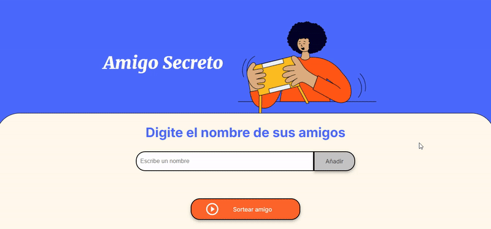

# 🎁 Amigo Secreto - Landing Page  

**Amigo Secreto** es una aplicación interactiva que permite a los usuarios ingresar nombres en una lista y realizar un sorteo aleatorio para determinar quién es el "amigo secreto".  

---

## 🚀 Funcionalidades  

✅ **Agregar nombres**: Los usuarios pueden escribir el nombre de un amigo en un campo de texto y agregarlo a una lista visible con el botón **"Añadir"**.  

✅ **Validar entrada**: Si el campo está vacío, se mostrará una alerta pidiendo un nombre válido.  

✅ **Visualizar la lista**: Los nombres ingresados aparecerán en una lista debajo del campo de entrada.  

✅ **Sorteo aleatorio**: Al hacer clic en el botón **"Sortear Amigo"**, se seleccionará aleatoriamente un nombre de la lista y se mostrará en pantalla.  

---

## 🎞️ Video Demo 
 
  

---

## 🛠️ Tecnologías utilizadas  

- **HTML5** - Estructura de la página  
- **CSS3** - Estilos y diseño responsivo  
- **JavaScript** - Lógica de validación y sorteo aleatorio  

---

## 🔧 Instalación y Uso  

1. Clona este repositorio:  
   ```sh
   git clone https://github.com/DMercadoCanas/challenge-amigo-secreto_esp-main.git
   cd challenge-amigo-secreto_esp-main
